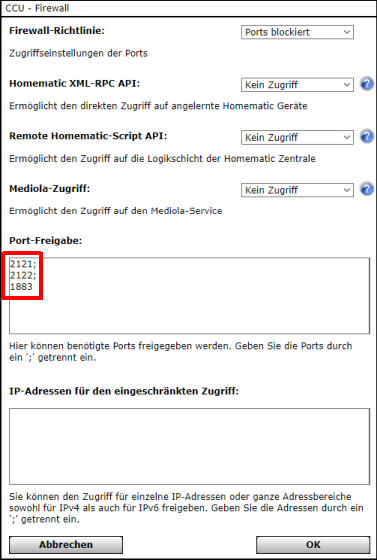
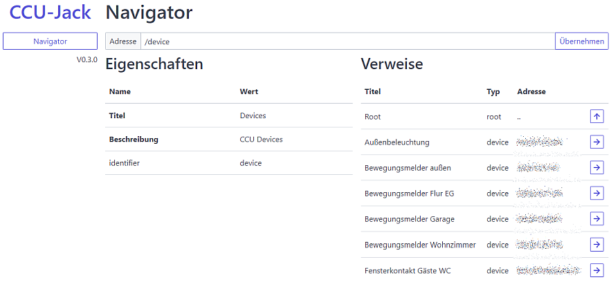
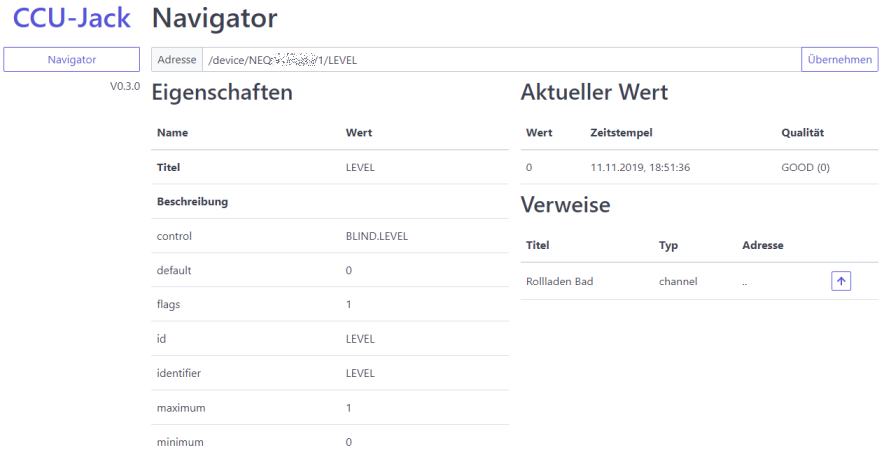
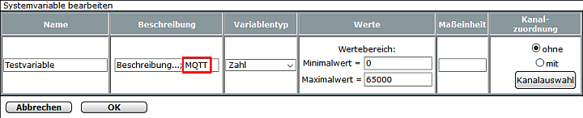

# CCU-Jack

CCU-Jack bietet einen einfachen und sicheren **REST**- und **MQTT**-basierten Zugriff auf die Datenpunkte der Zentrale (CCU) des [Hausautomations-Systems](http://de.wikipedia.org/wiki/Hausautomation) HomeMatic der Firma [eQ-3](http://www.eq-3.de/). Er implementiert dafür das [Very Easy Automation Protocol](https://github.com/mdzio/veap), welches von vielen Programmiersprachen leicht verwendet werden kann, und das [MQTT-Protokoll](https://de.wikipedia.org/wiki/MQTT), welches im Internet-of-Things weit verbreitet ist.

## Hauptmerkmale

Folgende Merkmale zeichnen CCU-Jack aus:
* Lese- und Schreibzugriff auf alle Gerätedatenpunkte und Systemvariablen der CCU.
* Alle Datenpunkte können über die REST-API baumartig erkundet werden.
* Umfangreiche Zusatzinformationen zu jedem Datenpunkt, z.B. Anzeigenamen, Räume, Gewerke, aber auch viele technische Informationen aus den XMLRPC-Schnittstellen und der ReGaHss stehen über die REST-API zur Verfügung.
* Hohe Performance und minimale Belastung der CCU-Prozesse (XMLRPC-Schnittstellen, ReGaHss, CCU Web-Server).
* Unterstützung von HTTP/2 und Verbindungssicherheit auf dem Stand der Technik. Zertifikate werden automatisch generiert.
* Vollständige Unterstützung von Cross-origin resource sharing (CORS) für die Anbindung von Web-Applikationen.
* Fertige Distributionen für viele Zielsysteme (**CCU2**, CCU3/RM, Windows, Linux, macOS).
* Die Verwendung des VEAP-Protokolls ermöglicht einfachste Anbindung von Applikationen und Frameworks (z.B. Angular, React, Vue). Zudem ist das Protokoll nicht CCU-spezifisch. Entwickelte Client-Applikationen könnnen auch mit anderen VEAP-Servern verwendet werden.
* Web-basierte Benutzerschnittstelle mit der alle Datenpunkte erkundet und die Werte überwacht werden können.

## Projekt

Ziel vom CCU-Jack ist es, möglichst einfach Datenpunkte zwischen CCUs und auch anderen Systemen auszutauschen und Applikationen eine Erkundungsmöglichkeit der Datenpunkte zu bieten. Der CCU-Jack wurde komplett neu entwickelt. Vorgänger vom CCU-Jack sind schon längere Zeit in Betrieb und tauschen hunderte von Datenpunkten zwischen mehreren CCUs, Internet-Relays und Front-Ends in Echtzeit aus.

### Leitlinien für die Umsetzung

Folgende Leitlinien sind bei der Entwicklung des CCU-Jacks maßgebend:
* **Einfache Installation** (Es soll z.B. keine Kommandozeile (SSH) oder ein Editieren von Konfigurationsdateien für die Inbetriebnahme benötigt werden.)
* **Einfache Anbindung von Fremdapplikationen** (Anderen Entwicklern soll es möglichst leicht fallen, ihre Applikationen an die CCU anzubinden. Die komplexe Ankopplung von etlichen CCU-Prozessen entfällt.)
* **Einfache Anbindung von IoT-Geräten** (IoT-Geräte sollen ohne Programmierung, Blockly oder Flows angebunden werden können.)
* **Sicherheit auf dem Stand der Technik** (TLS V1.3 wird unterstützt.)
* **Robust und leistungsfähig** (Hunderte von Clients werden gleichzeitig unterstützt. CCU-Jack enthält einen der schnellsten MQTT-Server.)

### Fahrplan

Nach der Implementierung von MQTT sind zukünftig erst einmal kleinere Erweiterungen geplant, um den CCU-Jack für die V1.0 abzurunden:

* Erweiterungen für MQTT
  * Unterstützung für Secure-MQTT und Websockets
  * Zugriffsberechtigungen
* Erweiterungen VEAP-API
  * Zugriffsberechtigungen
* Erweiterungen der Web-UI
  * Setzen von Datenpunkten im _Navigator_ und der _Überwachung_
  * Benutzer- und Rechteverwaltung

Langfristig sind dann bereits folgende Erweiterungen geplant:
* Erweiterungen für MQTT
  * Konfigurierbare Regeln für die Abbildung von _Topics_ und _Payloads_, um die Integration von MQTT-Geräten (z.B. [Tasmota](https://www.tasmota.info/)) zu erleichtern. 

Zukünftige Ideen:
* Austausch von Datenpunkten mit anderen CCUs oder MQTT-Servern. Dadurch könnten z.B. zwei CCUs direkt gekoppelt werden, oder bestimmte Datenpunkte an einen MQTT-Server im Internet gesendet oder von dort abgeholt werden.

## Download

Distributionen für die verschiedenen Zielsysteme sind auf der Seite [Releases](https://github.com/mdzio/ccu-jack/releases) zu finden. 

Zurzeit besitzt CCU-Jack noch Beta-Status. Es sollten also vor der Verwendung Sicherheitskopien von den involvierten Systemen erstellt werden (z.B. System-Backup von der CCU).

### Installation als Add-On auf der CCU

Bei einer Installation als Add-On auf der CCU können die Startparameter in der Datei `/usr/local/etc/config/rc.d/ccu-jack` angepasst werden. In der Regel ist dies nicht notwendig. Log-Meldungen werden in die Datei `/var/log/ccu-jack.log` geschrieben.

In der Firewall der CCU müssen je nach Anwendungsfall die Ports 2121 (HTTP), 2122 (HTTPS), 1883 (MQTT) und 8883 (Secure MQTT) freigegeben werden:



## Bauen aus den Quellen

Der CCU-Jack ist in der [Programmiersprache Go](https://golang.org/) (Version 1.13) geschrieben. Alle Distributionen des CCU-Jacks können sehr einfach und schnell auf allen möglichen Plattformen (u.a. Windows, Linux, MacOS) gebaut werden. Im GOPATH-Verzeichnis, dieses wird bei der Installation von Go festgelegt, müssen dafür folgende Kommandos ausgeführt werden:
```
go get github.com/mdzio/ccu-jack
cd src/github.com/mdzio/ccu-jack/build
go run .
```

## Kommandozeilenoptionen

Die Kommandozeilenoptionen vom CCU-Jack werden beim Start mit der Option `-h` aufgelistet:
```
usage of ccu-jack:
  -addr address
        address of the host (default "127.0.0.1")
  -ccu address
        address of the CCU (default "127.0.0.1")
  -cors host
        set host as allowed origin for CORS requests (default "*")
  -host name
        host name for certificate generation (normally autodetected)
  -http port
        port for serving HTTP (default 2121)
  -https port
        port for serving HTTPS (default 2122)
  -id identifier
        additional identifier for the XMLRPC init method (default "CCU-Jack")
  -interfaces types
        types of the CCU communication interfaces (comma separated): BidCosWired, BidCosRF, System, HmIPRF, VirtualDevices (default BidCosRF)
  -log severity
        specifies the minimum severity of printed log messages: off, error, warning, info, debug or trace (default INFO)
  -logfile file
        write log messages to file instead of stderr
  -mqtt port
        port for serving MQTT (default 1883)
  -mqtts port
        port for serving Secure MQTT (default 8883)
  -password password
        password for HTTP Basic Authentication/MQTT, q.v. -user
  -user name
        user name for HTTP Basic Authentication/MQTT (disabled by default)
```

Log-Meldungen werden auf der Fehlerausgabe (STDERR) oder in die mit der Option `-logfile` angegebenen Datei ausgegeben, wenn sie mindestens die mit der Option `-log` gesetzte Dringlichkeit besitzen.

## Performance

Folgende Angaben gelten für eine Installation als Add-On auf einer CCU3 (Raspberry Pi 3B, 4 Kerne mit 1,2 GHz):
* VEAP (REST-API)
  * 1,7 Millisekunden Latenz für das Lesen eines Datenpunktes über die REST-API.
  * 8.800 CCU-Datenpunkte können von 100 Clients pro Sekunde gesichert mit HTTPS-Verschlüsselung über die REST-API gelesen werden.
* MQTT
  * 198.000 Nachrichten (je 64 Bytes) können pro Sekunde von 5 über Netzwerk angebundenen MQTT-Clients ausgetauscht werden. Die CPU-Last von der CCU3 ist dann bei ca. 30%. CCU-Datenpunkte sind bei diesem Test nicht involviert.

## Web-basierte Benutzerschnittstelle

Die web-basierte Benutzerschnittstelle des CCU-Jacks ist über die Adressen `http://<host>:2121/ui` und `https://<host>:2122/ui` zu erreichen. `<host>` ist durch den Rechnernamen oder die IP-Adresse des Rechners zu ersetzen, auf dem CCU-Jack gestartet worden ist. Wenn es der lokale Rechner ist, kann auch `localhost` verwendet werden.

Mit Hilfe des Navigators können alle verfügbaren Datenpunkte erkundet werden:



Bei Variablen wird ebenfalls der Wert angezeigt und aktuell gehalten:



Variablen können für die Überwachung ausgewählt werden. Es werden in Echtzeit die aktuellen Werte angezeigt und Wertänderungen hervorgehoben:


## Beschreibung der VEAP-Dienste/REST-API

Mit dem [Kommandozeilenwerkzeug CURL](https://curl.haxx.se), das praktisch für alle Betriebssysteme und Plattformen verfügbar ist, können alle VEAP-Dienste (z.B. Datenpunkte lesen und setzen) des CCU-Jacks genutzt werden. Die Beschreibung ist auf einer [eigenen Seite](https://github.com/mdzio/ccu-jack/blob/master/doc/curl.md) zu finden.

## Beschreibung der MQTT-Schnittstelle

Der CCU-Jack enthält einen vollwertigen und leistungsfähigen MQTT-Server (V3.1.1). Dieser kann von beliebigen Fremdapplikationen genutzt werden. Zudem werden die Wertänderungen aller Gerätedatenpunkte der CCU und ausgewählter Systemvariablen automatisch an den MQTT-Server gesendet und stehen daraufhin allen MQTT-Clients zur Verfügung. 

Die _Topic_-Struktur ist an [mqtt-smarthome](https://github.com/mqtt-smarthome/mqtt-smarthome) angelehnt und wie folgt aufgebaut:

Topic | Beschreibung
------|-------------
device/status/_Seriennr._/_Kanalnr._/_Parametername_ | Unter diesem _Topic_ werden die Wertänderungen aller Gerätedatenpunkte bekanntgegeben.
device/set/_Seriennr._/_Kanalnr._/_Parametername_ | Über dieses _Topic_ können Gerätedatenpunkte gesetzt werden.
sysvar/status/_ISE-ID_ | Unter diesem _Topic_ werden die Wertänderungen von Systemvariablen bekanntgegeben, wenn die Systemvariablenbeschreibung in der CCU das Schlüsselwort `MQTT` enthält, oder vorher an das _Topic_ sysvar/get/_ISE-ID_ gesendet wurde.
sysvar/set/_ISE-ID_ | Über dieses _Topic_ können Systemvariablen gesetzt werden.
sysvar/get/_ISE-ID_ | Über dieses _Topic_ kann das Lesen einer Systemvariablen angestoßen werden. Der aktuelle Wert wird dann unter dem _Topic_ sysvar/status/_ISE-ID_ bekanntgegeben.

Die _Topics_ entsprechen bis auf den Dienstbestandteil (_status_, _set_ oder _get_) den VEAP-Adressen. Die VEAP-Adresse wird oben im _Navigator_ angezeigt.

Systemvariablen, die in der Beschreibung das Schlüsselwort `MQTT` enthalten, werden zyklisch gelesen und, falls sich der Wert oder Zeitstempel geändert hat, wird dieser gesendet. Die Beschreibung der Systemvariablen wird beim Start und dann alle 30 Minuten gelesen. Die Werte der Systemvariablen werden sekündlich reihum gelesen. Bei z.B. 10 markierten Systemvariablen, wird also eine Systemvariable alle 10 Sekunden gelesen.

Konfiguration einer Systemvariable für automatische MQTT-Übertragung:



Das Nachrichtenformat ist JSON und entspricht dem Format des [VEAP-Protokolls](https://github.com/mdzio/veap/blob/master/README_de.md#datenpunkt-lesen). Beispiel: `{"v":123.456,"ts":1483228800000,"s":0}`

Für das Setzen von Datenpunkten wird nur die Eigenschaft `v` benötigt. Beispiele: `{"v":123.456}` für Variablentyp Zahl, `{"v":2}` für Typ Werteliste, `{"v":true}` für Typ Logikwert/Alarm oder `{"v":"ABC"}` für Typ Zeichenkette. Falls ein JSON-Objekt mit anderen Eigenschaften oder direkt ein JSON-Wert verwendet wird, so wird dies für den Wert des Datenpunktes verwendet, z.B. `123.456`, `true` oder `"abc"`. Falls die Nachricht kein gültiges JSON enthält, so wird die gesamte Nachricht als Zeichnkette verwendet, z.B. `abc`.

Die Retain-Eigenschaft wird bei allen Datenpunkten gesetzt, außer der Parametername ist *INSTALL_TEST* oder beginnt mit *PRESS_*.

## Anwendungsbeispiele

### Android App _MQTT Dash_

Mit der kostenlosen Android App [MQTT Dash (IoT, Smart Home)](https://play.google.com/store/apps/details?id=net.routix.mqttdash&hl=de_DE) können Dashboards erstellt und über den CCU-Jack an die CCU angebunden werden.

### Android App _HTTP Request Shortcuts_

CCU-Jack ermöglicht der ebenfalls kostenlosen Android App [HTTP Request Shortcuts](https://play.google.com/store/apps/details?id=ch.rmy.android.http_shortcuts&hl=de_DE) einfachen Zugriff auf die Datenpunkte der CCU. So können beispielsweise Geräte direkt vom Home-Screen geschaltet werden. Beispiele sind auf einer [eigenen Seite](https://github.com/mdzio/ccu-jack/blob/master/doc/httpshortcuts.md) zu finden.

## Sicherheit

### Cross-origin resource sharing (CORS)

Um fremden Web-Applikationen den Zugriff auf die VEAP-API des CCU-Jacks zu ermöglichen, wird CORS vollständig unterstützt. In der Standardkonfiguration werden alle anfragenden Quellen zugelassen (`Access-Control-Allow-Origin: *`). Falls die Authentifizierung eingeschaltet ist (s.a. Kommandozeilenoptionen `-user` und `-password`) muss die Anfragequelle explizit zugelassen werden. Dies erfolgt mit der Kommandozeilenoption `-cors`.

Beispiel: Die Web-Applikation auf dem Host `https://example.com` soll mit Authentifizierung auf die VEAP-API zugreifen können. Dafür muss die Kommandozeilenoption `-cors https://example.com` gesetzt werden.

### Sicherer Zugriff über HTTPS

CCU-Jack ermöglicht einen verschlüsselten Zugriff über HTTPS, sodass auch über unsichere Netzwerke (z.B. Internet) Daten sicher ausgetauscht werden könnan. Über den Port 2122 (änderbar mit der Kommandozeilenoption `-porttls`) kann eine HTTPS-Verbindung aufgebaut werden. Die dafür benötigten Zertifikate können vorgegeben werden oder werden beim ersten Start vom CCU-Jack automatisch generiert.

Benötigte Zertifikatsdateien für den Server:

Dateiname   | Funktion
------------|---------
svrcert.pem | Zertifikat des Servers
svrcert.key | Privater Schlüssel des Servers (Dieser ist geheim zu halten.)

Falls die oben genannten Zertifikatsdateien im Arbeitsverzeichnis des CCU-Jacks nicht vorhanden sind, so werden automatisch zwei Zertifikate erstellt. Die Gültigkeit ist auf 10 Jahre eingestellt:

Dateiname   | Funktion
------------|---------
cacert.pem  | Zertifikat der Zertifizierungsstelle (CA)
cacert.key  | Privater Schlüssel der Zertifizierungsstelle (Dieser ist geheim zu halten.)
svrcert.pem | Zertifikat des Servers
svrcert.key | Privater Schlüssel des Servers (Dieser ist geheim zu halten.)

Für den sicheren Zugriff muss lediglich das generierte Zertifikat der Zertifizierungsstelle (`cacert.pem`) den HTTPS-Clients *über einen sicheren Kanal* bekannt gemacht werden. Das Zertifikat kann z.B. im Betriebssystem oder im Web-Browser installiert werden. Die privaten Schlüssel dürfen nie verteilt werden.

Über verschiedene Programmiersprachen kann auch verschlüsselt zugegriffen werden.

### Curl

```bash
curl --cacert path/to/cacert.pem https://hostname:2122
```

### Python

```python
import requests
r = requests.get("https://hostname:2122", verify='path/to/cacert.pem')
print(r.status_code)
```

### Go

```go
caCert, err := ioutil.ReadFile("path/to/cacert.pem")
if err != nil {
    log.Fatal(err)
}
caCerts := x509.NewCertPool()
ok := caCerts.AppendCertsFromPEM(caCert)
if !ok {
    log.Fatal("Failed to parse certificate")
}
con, err := tls.Dial("tcp", "hostname:2122", &tls.Config{RootCAs: caCerts})
if err != nil {
    log.Fatal(err)
}
defer con.Close()
```


### Javascript

```javascript
var fs = require('fs');
var https = require('https');

var get = https.request({
  path: '/', hostname: 'hostname', port: 2122,
  ca: fs.readFileSync('path/to/cacert.pem'),
  agent: false,
  rejectUnauthorized: true,
}, function(response) {
  response.on('data', (d) => {
    process.stdout.write(d);
  });
});
get.on('error', function(e) {
  console.error(e)
});
get.end();
```

## Lizenz und Haftungsausschluss

Lizenz und Haftungsausschluss sind in der Datei [LICENSE.txt](LICENSE.txt) zu finden.
