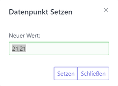
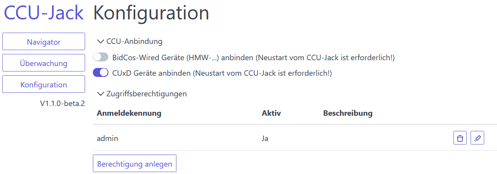

# CCU-Jack

CCU-Jack bietet einen einfachen und sicheren **REST**- und **MQTT**-basierten Zugriff auf die Datenpunkte der Zentrale (CCU) des [Hausautomations-Systems](http://de.wikipedia.org/wiki/Hausautomation) HomeMatic der Firma [eQ-3](http://www.eq-3.de/). Er implementiert dafür das [Very Easy Automation Protocol](https://github.com/mdzio/veap), welches von vielen Programmiersprachen leicht verwendet werden kann, und das [MQTT-Protokoll](https://de.wikipedia.org/wiki/MQTT), welches im Internet-of-Things weit verbreitet ist.

**Ziel vom CCU-Jack ist es, für andere Applikationen einen möglichst einfachen Zugriff auf die Datenpunkte der CCU zu ermöglichen.** Beispielsweise werden für den Zugriff auf eine CCU mit HM-, HM-Wired- und HM-IP-Geräten insgesamt 9 Netzwerkverbindung, teilweise als Rückkanal und mit unterschiedlichen Protokollen, benötigt. Zudem sind die Netzwerkschnittstellen der CCU unverschlüsselt, wodurch sie nicht in der Firewall der CCU freigeschaltet werden sollten. Der CCU-Jack standardisiert den Zugriff auf alle Geräte und Systemvariablen mit einem einheitlichen Protokoll und über eine verschlüsselte Verbindung.

Funktional ist der CCU-Jack eine Alternative zum [XML-API Add-On](https://github.com/jens-maus/XML-API). Das XML-API Add-On wird seit längerer Zeit nicht mehr weiter entwickelt und enthält nicht behobene Fehler und Sicherheitslücken. 

Zudem kann der CCU-Jack die Kombination der zwei Add-Ons [hm2mqtt](https://github.com/owagner/hm2mqtt) und [Mosquitto](https://github.com/hobbyquaker/ccu-addon-mosquitto) ersetzen. Das Add-On hm2mqtt wird ebenfalls seit längerer Zeit nicht mehr weiter entwickelt.

## Schnelleinstieg

* [Download](#download)
* [Beschreibung REST-API](https://github.com/mdzio/ccu-jack/blob/master/doc/curl.md)
* [Beschreibung MQTT-API](#beschreibung-der-mqtt-schnittstelle)

## Hauptmerkmale

Folgende Merkmale zeichnen CCU-Jack aus:
* Lese- und Schreibzugriff auf alle Gerätedatenpunkte (inkl. CUxD) und Systemvariablen der CCU.
* Alle Datenpunkte können über die REST-API baumartig erkundet werden.
* Umfangreiche Zusatzinformationen zu jedem Datenpunkt, z.B. Anzeigenamen, Räume, Gewerke, aber auch viele technische Informationen aus den XMLRPC-Schnittstellen und der ReGaHss stehen über die REST-API zur Verfügung.
* Hohe Performance und minimale Belastung der CCU-Prozesse (XMLRPC-Schnittstellen, ReGaHss, CCU Web-Server).
* Unterstützung von HTTP/2 und Verbindungssicherheit auf dem Stand der Technik. Zertifikate werden bei Bedarf automatisch generiert.
* Vollständige Unterstützung von Cross-origin resource sharing (CORS) für die Anbindung von Web-Applikationen.
* Fertige Distributionen für viele Zielsysteme (CCU2, CCU3/RM, Windows, Linux, macOS).
* Die Verwendung des VEAP-Protokolls ermöglicht einfachste Anbindung von Applikationen und Frameworks (z.B. Angular, React, Vue). Zudem ist das Protokoll nicht CCU-spezifisch. Entwickelte Client-Applikationen könnnen auch mit anderen VEAP-Servern verwendet werden.
* Web-basierte Benutzerschnittstelle mit der alle Datenpunkte erkundet und die Werte überwacht und verändert werden können.

### Leitlinien für die Umsetzung

Folgende Leitlinien sind bei der Entwicklung des CCU-Jacks maßgebend:
* **Einfache Installation** (Es soll z.B. keine Kommandozeile (SSH) oder ein Editieren von Konfigurationsdateien für die Inbetriebnahme benötigt werden.)
* **Einfache Anbindung von Fremdapplikationen** (Anderen Entwicklern soll es möglichst leicht fallen, ihre Applikationen an die CCU anzubinden. Die komplexe Ankopplung von etlichen CCU-Prozessen entfällt.)
* **Einfache Anbindung von IoT-Geräten** (IoT-Geräte sollen ohne Programmierung, Blockly oder Flows angebunden werden können.)
* **Sicherheit auf dem Stand der Technik** (TLS V1.3 wird unterstützt.)
* **Robust und leistungsfähig** (Hunderte von Clients werden gleichzeitig unterstützt. CCU-Jack enthält einen der schnellsten MQTT-Server.)

### Fahrplan

Mit der Veröffentlichung der V1.0 ist die für den CCU-Jack ursprünglich angedachte Funktionalität implementiert. Die REST-API (z.B. Pfade und Datenformat) und die MQTT-API (z.B. Topic-Aufbau) gelten als stabil. Alle zukünftigen Versionen erweitern höchstens das Grundgerüst (z.B. zusätzliche Pfade/Topics/Attribute). Alle Clients, die für die V1.0 entwickelt werden, sollten ohne Änderung mit zukünftigen Versionen des CCU-Jacks funktionieren.

Langfristig sind bereits folgende Erweiterungen geplant:
* Erweiterungen für MQTT
  * Konfigurierbare Regeln für die Umwandlung von _Topics_ und _Payloads_, um die Integration von MQTT-Geräten (z.B. [Tasmota](https://www.tasmota.info/)) zu erleichtern. 

Zukünftige Ideen:
* Austausch von Datenpunkten mit anderen CCUs oder MQTT-Servern. Dadurch könnten z.B. zwei CCUs direkt gekoppelt werden, oder bestimmte Datenpunkte an einen MQTT-Server im Internet gesendet oder von dort abgeholt werden.

## Unterstützung

Die größte Benutzergemeinde und auch der Hauptentwickler des CCU-Jacks sind im [HomeMatic-Forum](https://homematic-forum.de/forum/viewtopic.php?f=41&t=53553) zu finden.

## Download

Distributionen für die verschiedenen Zielsysteme sind auf der Seite [Releases](https://github.com/mdzio/ccu-jack/releases) zu finden. 

### Installation als Add-On auf der CCU

_Hinweis: Generell sollte vor der Installation von Add-Ons auf der CCU ein System-Backup erstellt werden._

Der CCU-Jack kann als Add-On auf der CCU installiert werden. Dies erfolgt über die Web-UI der CCU unter _Einstellungen_ → _Systemsteuerung_ → _Zusatzsoftware_. In diesem Dialog kann auch ein Neustart des CCU-Jacks durchgeführt werden. (Ein Neustart dauert 15-20 Sekunden.)

Bei einer Installation als Add-On auf der CCU können die Startparameter in der Datei `/usr/local/etc/config/rc.d/ccu-jack` angepasst werden. In der Regel ist dies nicht notwendig. Log-Meldungen werden in die Datei `/var/log/ccu-jack.log` geschrieben.

In der Firewall der CCU müssen je nach Anwendungsfall die Ports 2121 (HTTP), 2122 (HTTPS), 1883 (MQTT) und 8883 (Secure MQTT) freigegeben werden:


### Installation in einer Docker-Umgebung

Der CCU-Jack kann auch in einer Docker-Umgebung ausgeführt werden. Das Erstellen des Images und das Starten sind in [dieser Anleitung](https://github.com/mdzio/ccu-jack/tree/master/dist/docker) beschrieben. Ein fertiges Image ist unter [thetagamma/ccu-jack](https://hub.docker.com/r/thetagamma/ccu-jack) zu finden.

## Bauen aus den Quellen

Der CCU-Jack ist in der [Programmiersprache Go](https://golang.org/) (Version 1.15) geschrieben. Alle Distributionen des CCU-Jacks können sehr einfach und schnell auf allen möglichen Plattformen (u.a. Windows, Linux, MacOS) gebaut werden. Dafür in einem beliebigen Verzeichnis das Git-Repository klonen, oder die Quellen hinein kopieren. Danach in diesem Verzeichnis eine Kommandozeile öffnen, und folgende Befehle eingeben:
```
cd build
go run .
```
In dem Hauptverzeichnis werden dann alle Distributionen gebaut.

Für die Entwicklung bietet sich die Entwicklungsumgebug [Visual Studio Code](https://code.visualstudio.com/) an. Einfach das Hauptverzeichnis öffnen. Die nötigen Extensions werden automatisch zur Installation angeboten.

## Mitwirkung

Mitwirkende sind natürlich gerne gesehen. Sei es für die Dokumentation, das Testen, den Support im [HomeMatic-Forum](https://homematic-forum.de/forum/viewtopic.php?f=41&t=53553), die Fehlerbehebung oder die Implementierung neuer Funktionalität. Für Code-Beiträge ist die Lizenz (GPL v3) zu beachten. Code-Beiträge sollten immer auf einem neuen Branch separat vom `master`-Branch entwickelt werden.

## Konfiguration

Die Konfiguration des CCU-Jacks erfolgt über die Datei `ccu-jack.cfg`, die im Installationsverzeichnis zu finden ist. Viele Konfigurationsoptionen können bereits über das Web-UI geändert werden. Ansonsten kann diese Datei mit einem Texteditor angepasst werden, während der CCU-Jack nicht gestartet ist. Das Format der Datei ist [JSON](https://de.wikipedia.org/wiki/JavaScript_Object_Notation). Bei einer Installation als Add-On auf der CCU muss in der Regel die Konfigurationsdatei nicht angepasst werden.

Beispielkonfigurationsdatei:
```
{
  "CCU": {
    "Address": "192.168.0.10",
    "Interfaces": [
      "BidCosRF",
      "HmIPRF",
      "VirtualDevices"
    ],
    "InitID": "CCU-Jack"
  },
  "Host": {
    "Name": "",
    "Address": "192.168.0.11"
  },
  "Logging": {
    "Level": "INFO",
    "FilePath": "ccu-jack.log"
  },
  "HTTP": {
    "Port": 2121,
    "PortTLS": 2122,
    "CORSOrigins": [
      "*"
    ]
  },
  "MQTT": {
    "Port": 1883,
    "PortTLS": 8883
  },
  "BINRPC": {
    "Port": 2123
  },
  "Certificates": {
    "AutoGenerate": true,
    "CACertFile": "cacert.pem",
    "CAKeyFile": "cacert.key",
    "ServerCertFile": "svrcert.pem",
    "ServerKeyFile": "svrcert.key"
  },
  "Users": {}
}
```

Folgende zwei Optionen müssen mindestens vor dem ersten Start angepasst werden. Die IP-Adresse der CCU muss mit der Option `CCU.Address` gesetzt werden. Die IP-Adresse des Rechners, auf dem der CCU-Jack gestartet wird, muss mit der Option `Host.Address` gesetzt werden. Beide Optionen können auf `127.0.0.1` gesetzt werden, wenn der CCU-Jack direkt auf der CCU gestartet wird.

Log-Meldungen werden auf der Fehlerausgabe (STDERR) oder in die mit der Option `Logging.FilePath` angegebenen Datei ausgegeben, wenn sie mindestens die mit der Option `Logging.Level` gesetzte Dringlichkeit (OFF, ERROR, WARNING, INFO, DEBUG oder TRACE) besitzen.

## Anbindung CUxD

Der CCU-Jack kann auch die Datenpunkte des CUxD Add-Ons anbinden. Dies kann in der Web-UI des CCU-Jacks auf der Konfigurationsseite aktiviert werden. Eine Änderung der Option erfordert immer einen Neustart des CCU-Jacks. Neu angelegte CUxD-Geräte werden ebenfalls erst nach einem Neustart des CCU-Jacks erkannt.

## Performance

Folgende Angaben gelten für eine Installation als Add-On auf einer CCU3 (Raspberry Pi 3B, 4 Kerne mit 1,2 GHz):
* VEAP (REST-API)
  * 1,7 Millisekunden Latenz für das Lesen eines Datenpunktes über die REST-API.
  * 8.800 CCU-Datenpunkte können von 100 Clients pro Sekunde gesichert mit HTTPS-Verschlüsselung über die REST-API gelesen werden.
* MQTT
  * 198.000 Nachrichten (je 64 Bytes) können pro Sekunde von 5 über Netzwerk angebundenen MQTT-Clients ausgetauscht werden. Die CPU-Last von der CCU3 ist dann bei ca. 30%. CCU-Datenpunkte sind bei diesem Test nicht involviert.

## Web-basierte Benutzerschnittstelle

Die web-basierte Benutzerschnittstelle des CCU-Jacks ist über die Adressen `http://<host>:2121/ui` und `https://<host>:2122/ui` zu erreichen. `<host>` ist durch den Rechnernamen oder die IP-Adresse des Rechners zu ersetzen, auf dem CCU-Jack gestartet worden ist. Wenn es der lokale Rechner ist, kann auch `localhost` verwendet werden.

Mit Hilfe des Navigators können alle verfügbaren Datenpunkte erkundet werden:


Bei Variablen wird ebenfalls der Wert angezeigt und aktuell gehalten:


Durch Klick auf das Stift-Symbol kann der Wert eines Datenpunktes geändert werden:



Variablen können für die Überwachung ausgewählt werden. Es werden in Echtzeit die aktuellen Werte angezeigt und Wertänderungen hervorgehoben:


Die wichtigsten Konfigurationsoptionen des CCU-Jacks können über die Web-Oberfläche geändert werden:



## Beschreibung der VEAP-Dienste/REST-API

Mit dem [Kommandozeilenwerkzeug CURL](https://curl.haxx.se), das praktisch für alle Betriebssysteme und Plattformen verfügbar ist, können alle VEAP-Dienste (z.B. Datenpunkte lesen und setzen) des CCU-Jacks genutzt werden. Die Beschreibung ist auf einer [eigenen Seite](https://github.com/mdzio/ccu-jack/blob/master/doc/curl.md) zu finden.

Die Abbildung der CCU-Datentypen auf JSON ist [weiter unten](#abbildung-der-ccu-datentypen) zu finden.

## Beschreibung der MQTT-Schnittstelle

Der CCU-Jack enthält einen vollwertigen und leistungsfähigen MQTT-Server (V3.1.1). Dieser kann von beliebigen Fremdapplikationen genutzt werden. Zudem werden die Wertänderungen aller Gerätedatenpunkte der CCU und ausgewählter Systemvariablen automatisch an den MQTT-Server gesendet und stehen daraufhin allen MQTT-Clients zur Verfügung. Die Netzwerk-Ports können mit den Optionen `MQTT.Port` und `MQTT.PortTLS` eingestellt werden. Ein Zugriff über Web-Sockets ist über den Pfad `/ws-mqtt` des HTTP(S)-Servers möglich.

Um das MQTT-Protokoll hat sich ein großes Ökosystem gebildet. Eine Übersicht ist in dieser [Link-Sammlung](https://github.com/hobbyquaker/awesome-mqtt) zu finden.

Die _Topic_-Struktur ist an [mqtt-smarthome](https://github.com/mqtt-smarthome/mqtt-smarthome) angelehnt und wie folgt aufgebaut:

Topic | Beschreibung
------|-------------
device/status/_Seriennr._/_Kanalnr._/_Parametername_ | Unter diesem _Topic_ werden die Wertänderungen aller Gerätedatenpunkte bekanntgegeben.
device/set/_Seriennr._/_Kanalnr._/_Parametername_ | Über dieses _Topic_ können Gerätedatenpunkte gesetzt werden.
sysvar/status/_ISE-ID_ | Unter diesem _Topic_ werden die Wertänderungen von Systemvariablen bekanntgegeben, wenn die Systemvariablenbeschreibung in der CCU das Schlüsselwort `MQTT` enthält, oder vorher an das _Topic_ sysvar/get/_ISE-ID_ gesendet wurde.
sysvar/set/_ISE-ID_ | Über dieses _Topic_ können Systemvariablen gesetzt werden.
sysvar/get/_ISE-ID_ | Über dieses _Topic_ kann das Lesen einer Systemvariablen angestoßen werden. Der aktuelle Wert wird dann unter dem _Topic_ sysvar/status/_ISE-ID_ bekanntgegeben.
program/set/_ISE-ID_ | Über dieses _Topic_ können Programme auf der CCU gestartet werden. Es muss der boolesche Wert _true_ gesendet werden.
program/status/_ISE-ID_ | Unter diesem _Topic_ wird der letzte Ausführungszeitpunkt eines Programms bekanntgegeben, wenn vorher an das _Topic_ program/get/_ISE-ID_ gesendet wurde.
program/get/_ISE-ID_ | Über dieses _Topic_ kann das Lesen des letzten Ausführungszeitpunktes eines Programs angestoßen werden. Der aktuelle Wert wird dann unter dem _Topic_ program/status/_ISE-ID_ bekanntgegeben.

Die _Topics_ entsprechen bis auf den Dienstbestandteil (_status_, _set_ oder _get_) den VEAP-Adressen. Die VEAP-Adresse wird oben im _Navigator_ angezeigt. Bei den Datenpunkteigenschaften werden die _Topics_ unter _mqttStatusTopic_, _mqttSetTopic_ und _mqttGetTopic_ angezeigt. Das _Set-Topic_ wird nur bei beschreibbaren Datenpunkten angezeigt.

Systemvariablen, die in der Beschreibung (_Einstellungen_ → _Systemvariablen_) das Schlüsselwort `MQTT` (Groß-/Kleinschreibung egal) enthalten, werden zyklisch alle 3 Sekunden gelesen und, falls sich der Wert oder Zeitstempel geändert hat, wird dieser über MQTT versendet. Die Beschreibung der Systemvariablen wird beim Start und dann alle 30 Minuten gelesen. 300 Millisekunden nach dem Setzen einer Systemvariablen über MQTT wird der aktuelle Wert automatisch nochmals gelesen und per MQTT versendet.

Konfiguration einer Systemvariable für automatische MQTT-Übertragung:


Das Nachrichtenformat ist JSON und entspricht dem Format des [VEAP-Protokolls](https://github.com/mdzio/veap/blob/master/README_de.md#datenpunkt-lesen). Beispiel: `{"v":123.456,"ts":1483228800000,"s":0}`

Für das Setzen von Datenpunkten wird nur die Eigenschaft `v` benötigt. Beispiele: `{"v":123.456}` für Variablentyp Zahl, `{"v":2}` für Typ Werteliste, `{"v":true}` für Typ Logikwert/Alarm oder `{"v":"ABC"}` für Typ Zeichenkette. Falls ein JSON-Objekt mit anderen Eigenschaften oder direkt ein JSON-Wert verwendet wird, so wird dies für den Wert des Datenpunktes verwendet, z.B. `123.456`, `true` oder `"abc"`. Falls die Nachricht kein gültiges JSON enthält, so wird die gesamte Nachricht als Zeichnkette verwendet, z.B. `abc`.

Die Retain-Eigenschaft wird bei allen Datenpunkten gesetzt, außer der Parametername ist *INSTALL_TEST* oder beginnt mit *PRESS_*.

Die Abbildung der CCU-Datentypen auf JSON ist im nächsten Abschnitt zu finden.

## Abbildung der CCU-Datentypen

Der Datentyp eines CCU-Datenpunktes kann der Eigenschaft `type` entnommen werden. Anhand der folgenden Tabelle kann der zu nutzende JSON-Datentyp ermittelt werden:

`type`-Eigenschaft | JSON-Datentyp
-------------------|--------------
BOOL               | boolean (z.B. false, true)
ACTION             | boolean (nur true ist sinnvoll)
INTEGER oder ENUM  | number (nur ganzzahlige Werte sind sinnvoll, z.B. 2)
FLOAT              | number (Fließkommazahl, z.B. 0.123)
STRING             | string (z.B. "abc")

Bei den Datentypen INTEGER, ENUM oder FLOAT sollte der zu setzende Wert größer oder gleich der `minimum`-Eigenschaft sein und kleiner oder gleich der `maximum`-Eigenschaft.

## Anwendungsbeispiele

### Android App _MQTT Dash_

Mit der kostenlosen Android App [MQTT Dash (IoT, Smart Home)](https://play.google.com/store/apps/details?id=net.routix.mqttdash&hl=de_DE) können Dashboards erstellt und über den CCU-Jack an die CCU angebunden werden.

### Android App _HTTP Request Shortcuts_

CCU-Jack ermöglicht der ebenfalls kostenlosen Android App [HTTP Request Shortcuts](https://play.google.com/store/apps/details?id=ch.rmy.android.http_shortcuts&hl=de_DE) einfachen Zugriff auf die Datenpunkte der CCU. So können beispielsweise Geräte direkt vom Home-Screen geschaltet werden. Beispiele sind auf einer [eigenen Seite](https://github.com/mdzio/ccu-jack/blob/master/doc/httpshortcuts.md) zu finden.

## Sicherheit

### Cross-origin resource sharing (CORS)

Um fremden Web-Applikationen den Zugriff auf die VEAP-API des CCU-Jacks zu ermöglichen, wird CORS vollständig unterstützt. In der Standardkonfiguration werden alle anfragenden Quellen zugelassen (`Access-Control-Allow-Origin: *`). Falls die Authentifizierung eingeschaltet ist (s.a. Kommandozeilenoptionen `-user` und `-password`) muss die Anfragequelle explizit zugelassen werden. Dies erfolgt mit der Kommandozeilenoption `-cors`.

Beispiel: Die Web-Applikation auf dem Host `https://example.com` soll mit Authentifizierung auf die VEAP-API zugreifen können. Dafür muss die Kommandozeilenoption `-cors https://example.com` gesetzt werden.

### Sicherer Zugriff über TLS

CCU-Jack ermöglicht einen verschlüsselten Zugriff über HTTPS, sodass auch über unsichere Netzwerke (z.B. Internet) Daten sicher ausgetauscht werden könnan. Über den Port 2122 (änderbar mit der Konfigurationsoption `HTTP.PortTLS`) kann eine HTTPS-Verbindung aufgebaut werden. Analog gilt dies auch für MQTT-Verbindungen. Die dafür benötigten Zertifikate können vorgegeben werden oder werden beim ersten Start vom CCU-Jack automatisch generiert. Dies kann mit der Konfigurationsoption `Certificates.AutoGenerate` eingestellt werden.

Benötigte Zertifikatsdateien für den Server (vorhanden oder auto-generiert):

Dateiname   | Konfigurationsoption          | Funktion
------------|-------------------------------|-------------------------
svrcert.pem | `Certificates.ServerCertFile` | Zertifikat des Servers
svrcert.key | `Certificates.ServerKeyFile`  | Privater Schlüssel des Servers (Dieser ist geheim zu halten.)

Falls die Zertifikatsdateien automatisch generiert werden sollen, so sind folgende Konfigurationsoptionen zu setzen. Die Gültigkeit ist auf 10 Jahre eingestellt:

Dateiname   | Konfigurationsoption          | Funktion
------------|-------------------------------|-------------------------
cacert.pem  | `Certificates.CACertFile`     | Zertifikat der Zertifizierungsstelle (CA)
cacert.key  | `Certificates.CACertFile`     | Privater Schlüssel der Zertifizierungsstelle (Dieser ist geheim zu halten.)
svrcert.pem | `Certificates.ServerCertFile` | Zertifikat des Servers
svrcert.key | `Certificates.ServerKeyFile`  | Privater Schlüssel des Servers (Dieser geheim zu halten.)

Für den sicheren Zugriff muss lediglich das generierte Zertifikat der Zertifizierungsstelle (`cacert.pem`) den HTTPS-Clients *über einen sicheren Kanal* bekannt gemacht werden. Das Zertifikat kann z.B. im Betriebssystem oder im Web-Browser installiert werden. Die privaten Schlüssel dürfen nie verteilt werden.

Über verschiedene Programmiersprachen kann dann verschlüsselt zugegriffen werden.

### Curl

```bash
curl --cacert path/to/cacert.pem https://hostname:2122
```

### Python

```python
import requests
r = requests.get("https://hostname:2122", verify='path/to/cacert.pem')
print(r.status_code)
```

### Go

```go
caCert, err := ioutil.ReadFile("path/to/cacert.pem")
if err != nil {
    log.Fatal(err)
}
caCerts := x509.NewCertPool()
ok := caCerts.AppendCertsFromPEM(caCert)
if !ok {
    log.Fatal("Failed to parse certificate")
}
con, err := tls.Dial("tcp", "hostname:2122", &tls.Config{RootCAs: caCerts})
if err != nil {
    log.Fatal(err)
}
defer con.Close()
```


### Javascript

```javascript
var fs = require('fs');
var https = require('https');

var get = https.request({
  path: '/', hostname: 'hostname', port: 2122,
  ca: fs.readFileSync('path/to/cacert.pem'),
  agent: false,
  rejectUnauthorized: true,
}, function(response) {
  response.on('data', (d) => {
    process.stdout.write(d);
  });
});
get.on('error', function(e) {
  console.error(e)
});
get.end();
```

## Autoren

* [Mathias Dz.](https://github.com/mdzio)
* [martgras](https://github.com/martgras) (Raspberry Pi 4, Zertifikatsbehandlung)
* [twendt](https://github.com/twendt) (BIN-RPC für CUxD)
* [Theta Gamma](https://github.com/ThetaGamma) (Docker-Image)

## Lizenz und Haftungsausschluss

Lizenz und Haftungsausschluss sind in der Datei [LICENSE.txt](LICENSE.txt) zu finden.
