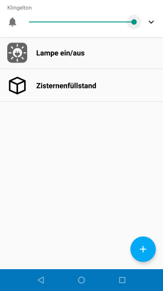
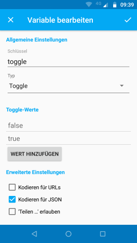
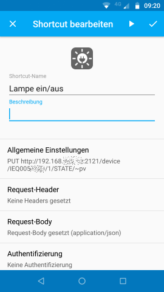
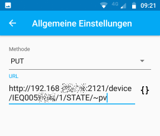
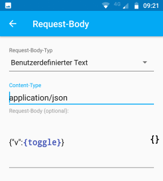
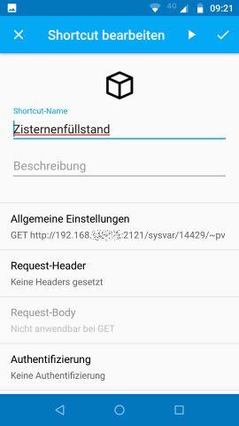
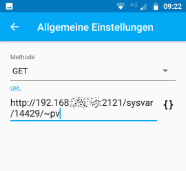
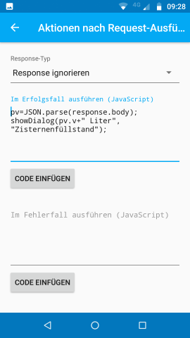

# Android App _HTTP Shortcuts_

CCU-Jack ermöglicht der kostenlosen Android App _HTTP Shortcuts_ einfachen Zugriff auf die Datenpunkte der CCU. Im Folgenden werden zwei Beispiele gezeigt.

## Aktor ein-/ausschalten

In diesem Beispiel wird gezeigt, wie eine Lampe ein- und ausgeschaltet werden kann.

### Variable anlegen

### Shortcut anlegen

### Allgemeine Einstellungen

In der Web-UI der CCU kann unter _Einstellungen_ → _Geräte_ die Seriennummer des Kanals ermittelt werden. Der `:` in der Seriennummer muss duch `/` ersetzt werden. Der Parametername ist beispielsweise  _STATE_ bei einem Schaltaktor oder _LEVEL_ bei einem Rollladenaktor.

### Request Body

## Systemvariable lesen

In diesem Beispiel wird gezeigt, wie eine Systemvariable ausgelesen und der Wert in einem Dialog angezeigt werden kann.

### Shortcut anlegen

### Allgemeine Einstellungen

Die ISE-ID der Systemvariablen (hier 14429) kann über die Adresse `http://a.b.c.d:2121/sysvar` (a.b.c.d durch die IP der CCU ersetzen) mit einem Web-Browser ermittelt werden.

### Aktion nach Request-Ausführung

Über JavaScript wird hier aus der VEAP-Antwort ein JSON-Objekt erstellt. Dieses besitzt in der Eigenschaft `v` den aktuellen Wert der Systemvariablen. Der Wert wird dann in einem Dialog angezeigt.

